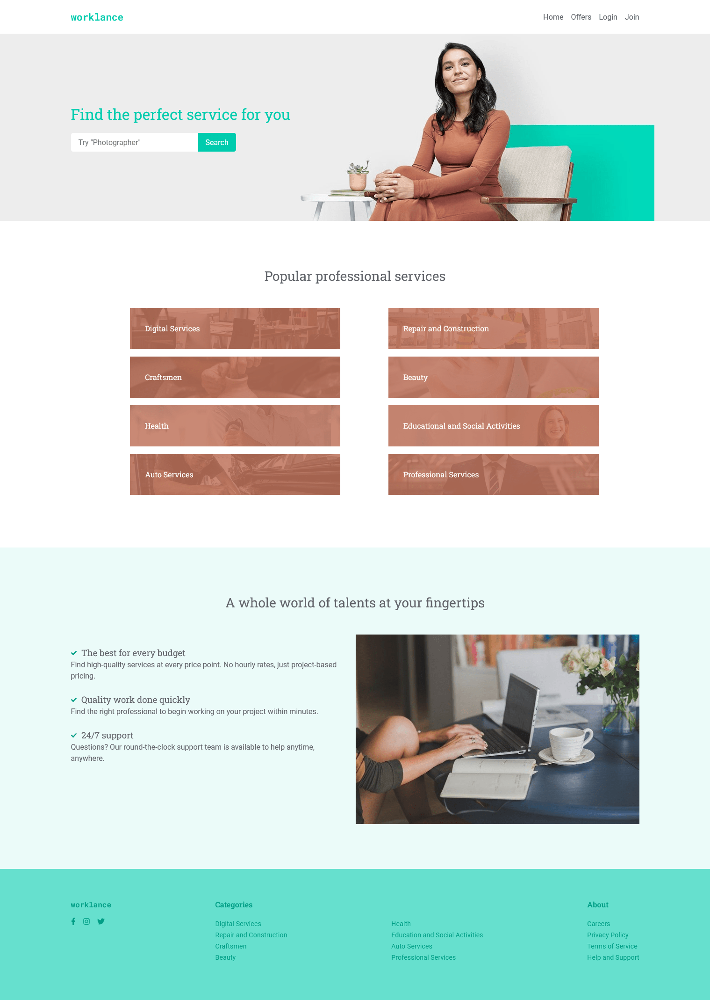

# Worklance

Hi, welcome to my MERN project service app.

## First, let me give you a sneak peak at my homepage.



## What functionalities we have

### For registered users

- Create offer page
- Profile page with:
    - User information
    - List of all created offers by the current user with edit and delete functionality
- Ability to comment and rate offers.

### For guest users

- Home page 
- Register
- Login
- Service catalog page
- Service details page

## And now how to run it

1. Download the repo.
2. Open it with a code editor of your choice.
3. We need two terminals, one for the client and another one for the server.
4. Execute the commands:

```
    cd client / cd server
    npm i
    npm start
```
